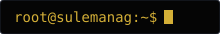

 

<table>
<tr><td align="center">

&nbsp;&nbsp;&nbsp;&nbsp;“<i>It's not who I am underneath, but what I commit that defines me.</i>”&nbsp;&nbsp;&nbsp;&nbsp;
  
<b>BUILD WITH PURPOSE • COMMIT WITH INTENT</b>

</td></tr>
</table>

 

  

  

## `~/about`

<table>
<tr>
<td width="55%" valign="top">

**Computer Science (Artificial Intelligence) undergraduate** at **KLE Technological University, Hubballi**, focused on **backend engineering and distributed systems**.

I design scalable Spring Boot services, event-driven architectures, and high-throughput transaction systems — with an emphasis on correctness, concurrency, and performance under real load.

education:
  university: KLE Technological University, Hubballi
  program: B.E. CSE (Artificial Intelligence)
  duration: 2023 - 2027
  cgpa: 8.61 / 10

focus_areas:
  - Backend architecture & API engineering
  - Distributed systems & event-driven design
  - Database internals & query optimization
  - Concurrent programming & system design
  - Performance & load testing

languages: [English, Hindi, Kannada]

</td>
<td width="45%" valign="top" align="center">

</td>
</tr>
</table>

## `~/technology`

<table>
<tr>
<td width="25%" valign="top">

**Languages**
  

</td>
<td width="25%" valign="top">

**Backend**
  

</td>
<td width="25%" valign="top">

**Data & Distributed Systems**
  

</td>
<td width="25%" valign="top">

**Infrastructure & Tooling**
  

</td>
</tr>
</table>

## `~/projects`

<table>
<tr>
<td width="33%" valign="top">

**LEDGERCORE**
 Jul 2025 — Present
  

High-throughput financial transaction infrastructure: a double-entry ledger and wallet system exposing REST APIs for transaction processing.

- **1K+ TPS** across **10K+ simulated accounts**
- Idempotent transactions and concurrency control
- Transactional **outbox pattern** for reliable delivery
- Event-driven balance projections via Kafka
- Kafka **dead-letter queues** with retry handling
- Validated through unit and integration test suites

</td>
<td width="33%" valign="top">

**RAITHA MITRA**
 Dec 2025 — Present
  

Smart agriculture platform translating coordination between **farmers, labour providers, and machinery owners** into role-based digital workflows.

- **200+ req/sec** validated under load testing
- JWT authentication with role-based access control
- **35% latency reduction** via Redis multi-tier caching
- Async processing, database indexing, connection pooling
- Load-tested with **JMeter**; bottlenecks profiled and resolved

</td>
<td width="33%" valign="top">

**PROJECT MESHMIND**
 Feb 2026 — Mar 2026
  

AI-powered offline emergency communication system for use during network outages.

- Multi-hop **BLE + Wi-Fi Direct** mesh routing
- Communication relay across **up to 5 hops**
- On-device **ONNX Runtime** route intelligence
- Stress-tested under simulated node failure and disruption

</td>
</tr>
</table>

## `~/research`

<table>
<tr>
<td valign="top">

**ConvKAN-Mixers: A Novel Deep Learning Architecture for Image Classification**
 Published — WCCST 2026, IEEE Xplore

A hybrid computer-vision architecture integrating **convolutional patch embeddings**, **ConvMixer blocks**, and **Kolmogorov–Arnold Network (KAN) layers** for efficient image classification. Trained with a custom **PyTorch** mixed-precision pipeline.

| Benchmark | Accuracy |
|---|---|
| FashionMNIST | **94.24%** |
| CIFAR-10 | **90.31%** |

</td>
</tr>
</table>

## `~/achievements`

<table>
<tr>
<td width="50%" align="center">

**Qualcomm Snapdragon Multiverse Hackathon 2026**
 Round 2 · Top 50 teams across India

</td>
<td width="50%" align="center">

**Flipkart GRiD 8.0**
 Round 2 · Software Development Track

</td>
</tr>
</table>

## `~/activity`

  

 Generated automatically by <code>assets/snake.yml</code> — see setup note below.

  

## `~/currently-learning`

## `~/contact`

  

